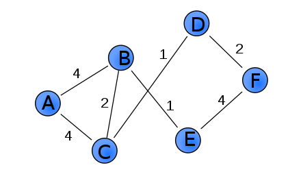

# 그래프(Graph)

그래프는 연결된 객체간의 관계를 정점(vertex)과 간선(edge)을 이용하여 표현하는 자료구조이다.

### 그래프의 예시

대학 강의의 선수과목, 도로망, 지하철 노선도

## 그래프의 종류

### 무방향 그래프(undirected graph)와 방향 그래프(directed graph)

`무방향 그래프(undirected graph)`

- 방향을 갖지 않는 간선을 사용한다.
- 양방향으로 갈 수 있다. 왕복 통행이 가능하다.
- 간선은 (A, B)로 표현한다.

`방향 그래프(directed graph)`

- 방향을 갖는 간선을 사용한다.
- 화살표가 향하는 방향으로만 갈 수 있다. 일방 통행을 의미한다.
- 간선은 <A, B>로 표현한다.

### 가중치 그래프

간선에 비용 또는 가중치가 할당된 그래프이다.

### 연결 그래프

고립된 정점이 없는 그래프이다. 모든 정점 쌍에 대하여 항상 경로가 존재한다. 출발지부터 목적지까지 여러 정점, 간선을 거쳐 도착할 수 있다.

### 트리

사이클을 갖지 않는 연결 그래프이다.

### 완전 그래프

서로 다른 두개의 정점이 반드시 하나의 간선으로 연결된 그래프이다. 모든 정점이 연결되어 있다.

## 용어
- `인접 정점(adjacent vertex)`: 해당 정점에서 간선에 의해 직접 연결된 정점이다.
- `차수(degree)`
  - 무방향 그래프에서는 해당 정점에 연결된 간선의 수이다.
  - 방향 그래프에서는
    - 진입 차수(in-degree): 외부에서 들어오는 간선의 수이다.
    - 진출 차수(out-degree): 외부로 향하는 간선의 수이다.
